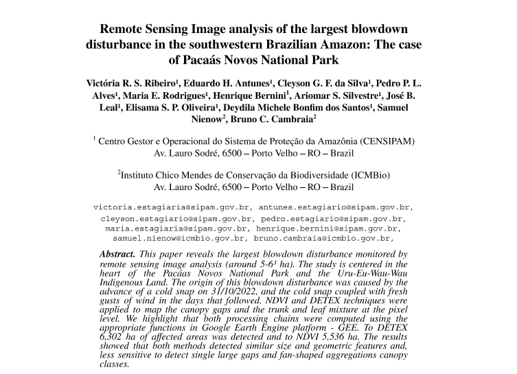

# Olá, eu sou a Madu 👋

### Analista de Dados | Geoprocessamento & Modelagem de Dados

Sou acadêmica de **Sistemas de Informação**, focada em transformar grandes volumes de dados brutos em inteligência geográfica e soluções de impacto real para a tomada de decisão. Possuo uma base sólida em modelagem de dados, análise espacial e administração de bancos de dados relacionais.

Atualmente, estou expandindo meus horizontes para a **Engenharia de Dados Cloud** e **IA**, buscando arquitetar pipelines escaláveis que unam inteligência analítica e visão geoespacial.

---

## 🛠️ Tech Stack

| Categoria | Tecnologias |
| :--- | :--- |
| **Dados & BD** |      |
| **Geoespacial** |     |
| **Programação** |     |
| **Cloud & IA** |   |

---

## 📈 Trajetória e Impacto Profissional

Atualmente, sou estagiária de **Análise de Dados Geoespaciais e Modelagem de BD** no **TCE-RO**. Focada no desenvolvimento de soluções escaláveis que integram tecnologia, análise espacial e inteligência de dados para gerar impacto real e sustentável:

* **🏛️ TCE-RO:** Atuação na modelagem de dados críticos e administração da plataforma *TCGeo-RO*, gerenciamento de bancos relacionais e espaciais (PostgreSQL/PostGIS) para o suporte à fiscalização estadual e controle externo.
* **🌳 Censipam:** Atuação técnica na manutenção e suporte do *Painel do Fogo*, uma plataforma estratégica de monitoramento geoespacial para a proteção da Amazônia.
* **🔬 Coautoria Científica:** Produção de inteligência científica aplicada ao sensoriamento remoto, com foco em fenômenos climáticos extremos. Publicação no GEOINFO 2023 do artigo: *Remote Sensing Image analysis of the largest blowdown disturbance in the southwestern Brazilian Amazon.*

---

### 🚀 Projetos em Destaque

<table>
  <tr>
    <td>
      
    </td>
    <td>
      <strong>Python & Cloud Computing: TCGeo-RO</strong> 
      <em>Plataforma estratégica de suporte à decisão e fiscalização baseada em dados geoespaciais e inteligência geográfica.</em> 
      <a href="https://app.tcgeo.tcero.tc.br/">🔗 Explorar Plataforma</a>
    </td>
  </tr>
  
  <tr>
    <td>
      
    </td>
    <td>
      <strong>Monitoramento Ambiental: Painel do Fogo</strong> 
      <em>Atuação técnica na manutenção de plataforma geoespacial para detecção e monitoramento de eventos de fogo na Amazônia (Censipam).</em> 
      <a href="https://panorama.sipam.gov.br/painel-do-fogo/">🔗 Ver Painel</a>
    </td>
  </tr>

  <tr>
    <td>
      
    </td>
    <td>
      <strong>Artigo Científico: GEOINFO 2023</strong> 
      <em>Análise de distúrbios de larga escala (blowdowns) na Amazônia utilizando Sensoriamento Remoto e Processamento Digital de Imagens.</em> 
      <a href="https://www.researchgate.net/publication/378333399_Remote_Sensing_Image_analysis_of_the_largest_blowdown_disturbance_in_the_southwestern_Brazilian_Amazon">📖 Ler Publicação</a>
    </td>
  </tr>
</table>

---

## 📫 Vamos nos conectar?

  
  

*“Transformando coordenadas em decisões, e dados em progresso.”*

  

